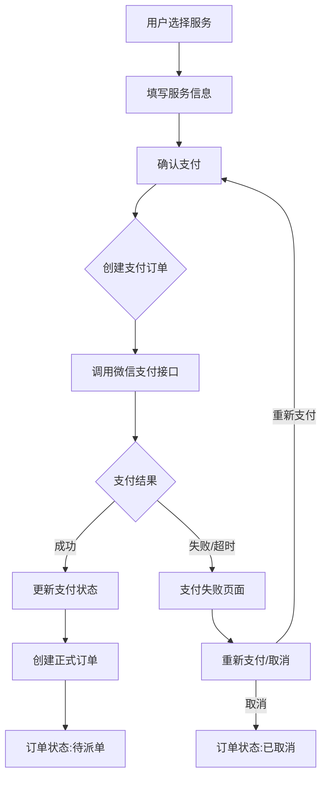
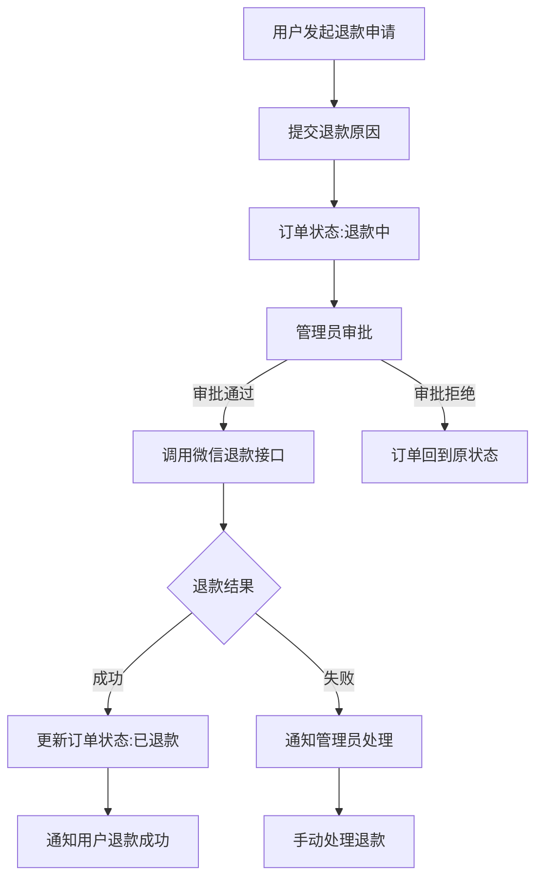

# 家政服务平台支付与退款流程设计

## 一、设计目标

根据业务需求，设计微信小程序支付（JSAPI模式）和退款流程，实现在用户选择服务后先支付再创建订单的业务逻辑，并支持用户申请退款、管理员审批的退款流程。

## 二、现有业务流程分析

### 现有订单流程
- 用户首页选择服务 -> 生成待派单订单 -> 管理员给订单指派护工 -> 护工接单 -> 服务完成 -> 订单闭环
- 订单状态：1:待派单, 2:已派单, 3:已接单, 5:已完成, 6:已取消, 7:已拒绝

### 现有订单实体结构
- 订单表包含：id, orderNo, userId, nurseId, serviceTypeId, totalAmount, status, serviceAddress, serviceTime, paymentTime等字段
- 目前支付时间字段存在但无实际支付流程

## 三、支付流程设计

### 3.1 业务流程图



### 3.2 数据库设计

#### 3.2.1 修改订单表（order）

| 字段名 | 数据类型 | 长度 | 说明 | 是否为空 | 备注 |
|-------|---------|------|-----|---------|------|
| id | BIGINT | 20 | 订单ID | 否 | 主键 |
| orderNo | VARCHAR | 50 | 订单编号 | 否 | 唯一 |
| userId | BIGINT | 20 | 用户ID | 否 | 外键 |
| nurseId | BIGINT | 20 | 护工ID | 是 | 外键 |
| serviceTypeId | BIGINT | 20 | 服务类型ID | 否 | 外键 |
| totalAmount | DECIMAL | 10,2 | 总金额 | 否 | |
| **status** | **INT** | **2** | **订单状态** | **否** | **新增0:待支付状态** |
| **paymentStatus** | **INT** | **2** | **支付状态** | **否** | **新增字段:0未支付,1已支付,2支付失败,3退款中,4已退款** |
| serviceAddress | VARCHAR | 255 | 服务地址 | 否 | |
| serviceTime | VARCHAR | 50 | 服务时间 | 否 | |
| paymentTime | VARCHAR | 50 | 支付时间 | 是 | |
| **paymentOrderId** | **VARCHAR** | **100** | **支付订单ID** | **是** | **新增字段，微信支付订单号** |
| **refundOrderId** | **VARCHAR** | **100** | **退款订单ID** | **是** | **新增字段，微信退款订单号** |
| **transactionId** | **VARCHAR** | **100** | **微信交易号** | **是** | **新增字段** |
| **expireTime** | **DATETIME** | | **订单过期时间** | **是** | **新增字段** |
| serviceStartTime | VARCHAR | 50 | 服务开始时间 | 是 | 原startTime重命名 |
| serviceEndTime | VARCHAR | 50 | 服务结束时间 | 是 | 原endTime重命名 |
| serviceDuration | INT | 11 | 服务时长（分钟） | 否 | |
| createTime | DATETIME | | 创建时间 | 否 | |
| updateTime | DATETIME | | 更新时间 | 否 | |

#### 3.2.2 新增支付记录表（payment_record）

| 字段名 | 数据类型 | 长度 | 说明 | 是否为空 | 备注 |
|-------|---------|------|-----|---------|------|
| id | BIGINT | 20 | 记录ID | 否 | 主键 |
| orderId | BIGINT | 20 | 订单ID | 否 | 外键，关联order表 |
| orderNo | VARCHAR | 50 | 订单编号 | 否 | |
| userId | BIGINT | 20 | 用户ID | 否 | 外键 |
| amount | DECIMAL | 10,2 | 支付金额 | 否 | |
| paymentType | VARCHAR | 20 | 支付类型 | 否 | 如：WECHAT |
| paymentOrderId | VARCHAR | 100 | 支付订单ID | 是 | 微信支付订单号 |
| transactionId | VARCHAR | 100 | 微信交易号 | 是 | |
| paymentStatus | INT | 2 | 支付状态 | 否 | 0:待支付,1:已支付,2:支付失败 |
| payTime | DATETIME | | 支付时间 | 是 | |
| createTime | DATETIME | | 创建时间 | 否 | |
| updateTime | DATETIME | | 更新时间 | 否 | |
| remark | VARCHAR | 255 | 备注 | 是 | |

### 3.3 后端接口设计

#### 3.3.1 创建支付订单接口

- **URL**: `/api/payment/create`
- **方法**: `POST`
- **功能**: 创建待支付订单，生成支付参数
- **请求体**:
  ```json
  {
    "serviceTypeId": 1,
    "totalAmount": 100.00,
    "serviceAddress": "北京市朝阳区xxx路xxx号",
    "serviceTime": "2023-06-15 10:00:00",
    "serviceDuration": 120
  }
  ```
- **响应**:
  ```json
  {
    "code": 200,
    "message": "success",
    "data": {
      "orderId": 1,
      "orderNo": "202306150001",
      "paymentParams": {
        "timeStamp": "1686829200",
        "nonceStr": "abcdefg123456",
        "package": "prepay_id=wx201234567890",
        "signType": "MD5",
        "paySign": "a1b2c3d4e5f6g7h8i9j0"
      }
    }
  }
  ```

#### 3.3.2 支付回调接口

- **URL**: `/api/payment/notify`
- **方法**: `POST`
- **功能**: 微信支付异步通知接口
- **参数**: 微信支付标准通知参数（XML格式）
- **响应**: 微信支付标准响应（XML格式）

#### 3.3.3 查询支付状态接口

- **URL**: `/api/payment/status/{orderId}`
- **方法**: `GET`
- **功能**: 查询订单支付状态
- **响应**:
  ```json
  {
    "code": 200,
    "message": "success",
    "data": {
      "orderId": 1,
      "orderNo": "202306150001",
      "paymentStatus": 1,
      "paymentTime": "2023-06-15 10:05:30"
    }
  }
  ```

#### 3.3.4 关闭支付订单接口

- **URL**: `/api/payment/close/{orderId}`
- **方法**: `POST`
- **功能**: 关闭未支付订单
- **响应**:
  ```json
  {
    "code": 200,
    "message": "关闭成功",
    "data": null
  }
  ```

### 3.4 前端接口设计

#### 3.4.1 修改API配置

在 `api.js` 中添加支付相关接口：

```javascript
// 支付相关接口
payment: {
  // 创建支付订单
  create: `${BASE_URL}/payment/create`,
  // 查询支付状态
  status: `${BASE_URL}/payment/status`,
  // 关闭支付订单
  close: `${BASE_URL}/payment/close`
}
```

#### 3.4.2 页面流程修改

1. **服务请求页面**：修改提交逻辑，先调用支付接口
2. **支付页面**：新增支付页面，调用微信支付SDK
3. **支付结果页面**：处理支付成功/失败的展示

## 四、退款流程设计

### 4.1 业务流程图



### 4.2 数据库设计

#### 4.2.1 新增退款申请表（refund_application）

| 字段名 | 数据类型 | 长度 | 说明 | 是否为空 | 备注 |
|-------|---------|------|-----|---------|------|
| id | BIGINT | 20 | 申请ID | 否 | 主键 |
| orderId | BIGINT | 20 | 订单ID | 否 | 外键，关联order表 |
| orderNo | VARCHAR | 50 | 订单编号 | 否 | |
| userId | BIGINT | 20 | 用户ID | 否 | 外键 |
| refundAmount | DECIMAL | 10,2 | 退款金额 | 否 | |
| refundReason | VARCHAR | 500 | 退款原因 | 否 | |
| applicationTime | DATETIME | | 申请时间 | 否 | |
| auditStatus | INT | 2 | 审核状态 | 否 | 0:待审核,1:审核通过,2:审核拒绝 |
| auditTime | DATETIME | | 审核时间 | 是 | |
| auditorId | BIGINT | 20 | 审核人ID | 是 | 外键，关联admin表 |
| auditRemark | VARCHAR | 500 | 审核备注 | 是 | |
| refundStatus | INT | 2 | 退款状态 | 否 | 0:未退款,1:退款中,2:退款成功,3:退款失败 |
| refundTime | DATETIME | | 退款时间 | 是 | |
| refundOrderId | VARCHAR | 100 | 退款订单ID | 是 | 微信退款订单号 |
| createTime | DATETIME | | 创建时间 | 否 | |
| updateTime | DATETIME | | 更新时间 | 否 | |

### 4.3 后端接口设计

#### 4.3.1 提交退款申请接口

- **URL**: `/api/refund/apply`
- **方法**: `POST`
- **功能**: 用户提交退款申请
- **请求体**:
  ```json
  {
    "orderId": 1,
    "refundReason": "服务时间冲突，无法接受服务"
  }
  ```
- **响应**:
  ```json
  {
    "code": 200,
    "message": "申请提交成功，请等待审核",
    "data": {
      "applicationId": 1,
      "auditStatus": 0
    }
  }
  ```

#### 4.3.2 管理员审核退款接口

- **URL**: `/api/refund/audit`
- **方法**: `POST`
- **功能**: 管理员审核退款申请
- **请求体**:
  ```json
  {
    "applicationId": 1,
    "auditStatus": 1,  // 1:通过, 2:拒绝
    "auditRemark": "同意退款"
  }
  ```
- **响应**:
  ```json
  {
    "code": 200,
    "message": "审核成功",
    "data": {
      "applicationId": 1,
      "auditStatus": 1,
      "refundStatus": 1  // 1:退款中
    }
  }
  ```

#### 4.3.3 查询退款记录接口

- **URL**: `/api/refund/records`
- **方法**: `GET`
- **功能**: 查询用户的退款记录
- **请求参数**:
  - `userId`: 用户ID
  - `page`: 页码
  - `pageSize`: 每页数量
- **响应**:
  ```json
  {
    "code": 200,
    "message": "success",
    "data": {
      "records": [
        {
          "id": 1,
          "orderId": 1,
          "orderNo": "202306150001",
          "refundAmount": 100.00,
          "refundReason": "服务时间冲突",
          "applicationTime": "2023-06-16 09:00:00",
          "auditStatus": 1,
          "auditTime": "2023-06-16 10:00:00",
          "refundStatus": 2,
          "refundTime": "2023-06-16 10:30:00"
        }
      ],
      "total": 1,
      "page": 1,
      "pageSize": 10
    }
  }
  ```

#### 4.3.4 退款回调接口

- **URL**: `/api/refund/notify`
- **方法**: `POST`
- **功能**: 微信退款异步通知接口
- **参数**: 微信退款标准通知参数（XML格式）
- **响应**: 微信退款标准响应（XML格式）

### 4.4 前端接口设计

#### 4.4.1 修改API配置

在 `api.js` 中添加退款相关接口：

```javascript
// 退款相关接口
refund: {
  // 提交退款申请
  apply: `${BASE_URL}/refund/apply`,
  // 查询退款记录
  records: `${BASE_URL}/refund/records`
}
```

#### 4.4.2 页面设计

1. **订单详情页**：添加申请退款按钮（仅在可退款状态显示）
2. **退款申请页**：填写退款原因
3. **退款记录页**：展示退款申请历史和状态

## 五、微信支付第三方接口集成

### 5.1 统一下单接口

**接口说明**：调用微信支付统一下单API，获取预支付交易会话标识

**请求URL**：`https://api.mch.weixin.qq.com/pay/unifiedorder`

**请求方法**：`POST`

**请求参数**：(XML格式)

| 参数名 | 必填 | 类型 | 说明 |
|-------|------|------|------|
| appid | 是 | String(32) | 微信支付分配的公众账号ID |
| mch_id | 是 | String(32) | 微信支付分配的商户号 |
| nonce_str | 是 | String(32) | 随机字符串，不长于32位 |
| sign | 是 | String(32) | 签名，详见签名算法 |
| body | 是 | String(128) | 商品描述 |
| out_trade_no | 是 | String(32) | 商户订单号 |
| total_fee | 是 | Int | 订单总金额，单位为分 |
| spbill_create_ip | 是 | String(16) | 终端IP |
| notify_url | 是 | String(256) | 通知地址，异步接收支付结果通知的回调地址 |
| trade_type | 是 | String(16) | 交易类型，小程序取值为JSAPI |
| openid | 是 | String(128) | 用户在商户appid下的唯一标识 |

**返回参数**：(XML格式)

| 参数名 | 类型 | 说明 |
|-------|------|------|
| return_code | String(16) | 通信状态码 |
| return_msg | String(128) | 通信状态描述 |
| result_code | String(16) | 业务结果 |
| err_code | String(32) | 错误代码 |
| err_code_des | String(128) | 错误代码描述 |
| appid | String(32) | 公众账号ID |
| mch_id | String(32) | 商户号 |
| nonce_str | String(32) | 随机字符串 |
| sign | String(32) | 签名 |
| prepay_id | String(64) | 预支付交易会话标识 |
| trade_type | String(16) | 交易类型 |

### 5.2 支付结果通知接口

**接口说明**：微信支付成功后，异步通知商户系统

**通知URL**：商户在统一下单接口中设置的notify_url

**通知方法**：`POST`

**通知参数**：(XML格式)

| 参数名 | 类型 | 说明 |
|-------|------|------|
| return_code | String(16) | 通信状态码 |
| return_msg | String(128) | 通信状态描述 |
| result_code | String(16) | 业务结果 |
| mch_id | String(32) | 商户号 |
| openid | String(128) | 用户标识 |
| is_subscribe | String(1) | 是否关注公众账号 |
| trade_type | String(16) | 交易类型 |
| bank_type | String(16) | 银行类型 |
| total_fee | Int | 订单总金额，单位为分 |
| settlement_total_fee | Int | 应结订单金额 |
| fee_type | String(8) | 货币类型 |
| transaction_id | String(32) | 微信支付订单号 |
| out_trade_no | String(32) | 商户订单号 |
| attach | String(128) | 商家数据包 |
| time_end | String(14) | 支付完成时间 |
| sign | String(32) | 签名 |

**响应参数**：(XML格式)

| 参数名 | 类型 | 说明 |
|-------|------|------|
| return_code | String(16) | 通信状态码 |
| return_msg | String(128) | 通信状态描述 |

### 5.3 查询订单接口

**接口说明**：查询订单状态

**请求URL**：`https://api.mch.weixin.qq.com/pay/orderquery`

**请求方法**：`POST`

**请求参数**：(XML格式)

| 参数名 | 必填 | 类型 | 说明 |
|-------|------|------|------|
| appid | 是 | String(32) | 公众账号ID |
| mch_id | 是 | String(32) | 商户号 |
| out_trade_no | 二选一 | String(32) | 商户订单号 |
| transaction_id | 二选一 | String(32) | 微信支付订单号 |
| nonce_str | 是 | String(32) | 随机字符串 |
| sign | 是 | String(32) | 签名 |

**返回参数**：(XML格式)

| 参数名 | 类型 | 说明 |
|-------|------|------|
| return_code | String(16) | 通信状态码 |
| return_msg | String(128) | 通信状态描述 |
| result_code | String(16) | 业务结果 |
| err_code | String(32) | 错误代码 |
| err_code_des | String(128) | 错误代码描述 |
| trade_state | String(32) | 交易状态 |
| openid | String(128) | 用户标识 |
| is_subscribe | String(1) | 是否关注公众账号 |
| trade_type | String(16) | 交易类型 |
| bank_type | String(16) | 银行类型 |
| total_fee | Int | 订单总金额，单位为分 |
| fee_type | String(8) | 货币类型 |
| transaction_id | String(32) | 微信支付订单号 |
| out_trade_no | String(32) | 商户订单号 |
| attach | String(128) | 商家数据包 |
| time_end | String(14) | 支付完成时间 |
| trade_state_desc | String(256) | 交易状态描述 |

### 5.4 关闭订单接口

**接口说明**：关闭未支付的订单

**请求URL**：`https://api.mch.weixin.qq.com/pay/closeorder`

**请求方法**：`POST`

**请求参数**：(XML格式)

| 参数名 | 必填 | 类型 | 说明 |
|-------|------|------|------|
| appid | 是 | String(32) | 公众账号ID |
| mch_id | 是 | String(32) | 商户号 |
| out_trade_no | 是 | String(32) | 商户订单号 |
| nonce_str | 是 | String(32) | 随机字符串 |
| sign | 是 | String(32) | 签名 |

**返回参数**：(XML格式)

| 参数名 | 类型 | 说明 |
|-------|------|------|
| return_code | String(16) | 通信状态码 |
| return_msg | String(128) | 通信状态描述 |
| result_code | String(16) | 业务结果 |
| err_code | String(32) | 错误代码 |
| err_code_des | String(128) | 错误代码描述 |

### 5.5 申请退款接口

**接口说明**：申请退款，需要证书

**请求URL**：`https://api.mch.weixin.qq.com/secapi/pay/refund`

**请求方法**：`POST`

**请求参数**：(XML格式)

| 参数名 | 必填 | 类型 | 说明 |
|-------|------|------|------|
| appid | 是 | String(32) | 公众账号ID |
| mch_id | 是 | String(32) | 商户号 |
| nonce_str | 是 | String(32) | 随机字符串 |
| sign | 是 | String(32) | 签名 |
| transaction_id | 二选一 | String(32) | 微信支付订单号 |
| out_trade_no | 二选一 | String(32) | 商户订单号 |
| out_refund_no | 是 | String(64) | 商户退款单号 |
| total_fee | 是 | Int | 订单总金额，单位为分 |
| refund_fee | 是 | Int | 退款金额，单位为分 |
| refund_desc | 否 | String(80) | 退款原因 |
| notify_url | 否 | String(256) | 退款结果通知url |

**返回参数**：(XML格式)

| 参数名 | 类型 | 说明 |
|-------|------|------|
| return_code | String(16) | 通信状态码 |
| return_msg | String(128) | 通信状态描述 |
| result_code | String(16) | 业务结果 |
| err_code | String(32) | 错误代码 |
| err_code_des | String(128) | 错误代码描述 |
| refund_id | String(32) | 微信退款单号 |
| out_refund_no | String(64) | 商户退款单号 |
| refund_fee | Int | 退款金额 |
| total_fee | Int | 订单总金额 |
| cash_fee | Int | 现金支付金额 |
| cash_refund_fee | Int | 现金退款金额 |

### 5.6 退款结果通知接口

**接口说明**：退款成功后，异步通知商户系统

**通知URL**：商户在申请退款接口中设置的notify_url

**通知方法**：`POST`

**通知参数**：(XML格式)

| 参数名 | 类型 | 说明 |
|-------|------|------|
| return_code | String(16) | 通信状态码 |
| return_msg | String(128) | 通信状态描述 |
| appid | String(32) | 公众账号ID |
| mch_id | String(32) | 商户号 |
| nonce_str | String(32) | 随机字符串 |
| sign | String(32) | 签名 |
| result_code | String(16) | 业务结果 |
| refund_status | String(16) | 退款状态 |
| transaction_id | String(32) | 微信支付订单号 |
| out_trade_no | String(32) | 商户订单号 |
| refund_id | String(32) | 微信退款单号 |
| out_refund_no | String(64) | 商户退款单号 |
| total_fee | Int | 订单总金额，单位为分 |
| settlement_total_fee | Int | 应结订单金额 |
| refund_fee | Int | 退款金额 |
| settlement_refund_fee | Int | 应结退款金额 |
| cash_fee | Int | 现金支付金额 |
| cash_refund_fee | Int | 现金退款金额 |
| refund_recv_accout | String(64) | 退款入账账户 |
| refund_account | String(30) | 退款资金来源 |
| refund_success_time | String(20) | 退款成功时间 |

**响应参数**：(XML格式)

| 参数名 | 类型 | 说明 |
|-------|------|------|
| return_code | String(16) | 通信状态码 |
| return_msg | String(128) | 通信状态描述 |

## 六、关键类与方法设计

### 6.1 支付相关

#### 6.1.1 PaymentService 接口

```java
public interface PaymentService {
    /**
     * 创建支付订单
     * @param userId 用户ID
     * @param orderInfo 订单信息
     * @return 支付参数
     */
    Map<String, Object> createPaymentOrder(Long userId, Map<String, Object> orderInfo);
    
    /**
     * 处理支付回调
     * @param notifyData 回调数据
     * @return 处理结果
     */
    boolean handlePaymentNotify(Map<String, String> notifyData);
    
    /**
     * 查询支付状态
     * @param orderId 订单ID
     * @return 支付状态信息
     */
    Map<String, Object> queryPaymentStatus(Long orderId);
    
    /**
     * 关闭支付订单
     * @param orderId 订单ID
     * @return 是否成功
     */
    boolean closePaymentOrder(Long orderId);
}
```

#### 6.1.2 WechatPayUtil 工具类

```java
public class WechatPayUtil {
    /**
     * 生成预支付订单
     * @param orderInfo 订单信息
     * @return 预支付参数
     */
    public static Map<String, String> createPrepayOrder(Map<String, Object> orderInfo);
    
    /**
     * 生成支付签名
     * @param params 参数
     * @return 签名
     */
    public static String generatePaySign(Map<String, String> params);
    
    /**
     * 验证回调签名
     * @param notifyData 回调数据
     * @return 是否验证通过
     */
    public static boolean verifyNotifySign(Map<String, String> notifyData);
    
    /**
     * 申请退款
     * @param refundInfo 退款信息
     * @return 退款结果
     */
    public static Map<String, String> refund(Map<String, Object> refundInfo);
}
```

### 6.2 退款相关

#### 6.2.1 RefundService 接口

```java
public interface RefundService {
    /**
     * 提交退款申请
     * @param userId 用户ID
     * @param orderId 订单ID
     * @param reason 退款原因
     * @return 申请结果
     */
    boolean submitRefundApplication(Long userId, Long orderId, String reason);
    
    /**
     * 审核退款申请
     * @param applicationId 申请ID
     * @param auditStatus 审核状态
     * @param auditorId 审核人ID
     * @param remark 审核备注
     * @return 审核结果
     */
    boolean auditRefundApplication(Long applicationId, Integer auditStatus, Long auditorId, String remark);
    
    /**
     * 处理退款回调
     * @param notifyData 回调数据
     * @return 处理结果
     */
    boolean handleRefundNotify(Map<String, String> notifyData);
    
    /**
     * 查询用户退款记录
     * @param userId 用户ID
     * @param page 页码
     * @param pageSize 每页数量
     * @return 退款记录
     */
    IPage<RefundApplication> getUserRefundRecords(Long userId, int page, int pageSize);
}
```

## 七、前端实现关键点

### 7.1 支付流程实现

1. **修改服务请求提交流程**：

```javascript
// 在service-request.js中修改submitRequest方法
submitRequest: function() {
  // 表单验证
  if (!this.validateForm()) {
    return;
  }
  
  // 构造支付请求数据
  const paymentData = {
    serviceTypeId: this.data.serviceId,
    totalAmount: parseFloat(this.data.expectedPrice),
    serviceAddress: this.data.serviceAddress,
    serviceTime: this.data.expectedTime + ':00',
    serviceDuration: parseInt(this.data.expectedDuration)
  };
  
  // 调用创建支付订单接口
  request(API.payment.create, {
    method: 'POST',
    data: paymentData
  }).then(res => {
    if (res.code === 200) {
      // 保存订单信息
      wx.setStorageSync('pendingOrder', res.data);
      
      // 调用微信支付
      wx.requestPayment({
        ...res.data.paymentParams,
        success: (payRes) => {
          // 支付成功，跳转到支付结果页
          wx.redirectTo({
            url: '/pages/payment-result/payment-result?status=success&orderId=' + res.data.orderId
          });
        },
        fail: (payErr) => {
          // 支付失败，跳转到支付结果页
          wx.redirectTo({
            url: '/pages/payment-result/payment-result?status=fail&orderId=' + res.data.orderId
          });
        }
      });
    } else {
      wx.showToast({
        title: res.message || '创建支付订单失败',
        icon: 'none'
      });
    }
  }).catch(err => {
    console.error('创建支付订单失败:', err);
    wx.showToast({
      title: '网络异常，请稍后重试',
      icon: 'none'
    });
  });
}
```

2. **支付结果页面逻辑**：

```javascript
// payment-result.js
onLoad: function(options) {
  const { status, orderId } = options;
  this.setData({
    status: status,
    orderId: orderId
  });
  
  // 如果支付成功，查询订单最终状态
  if (status === 'success') {
    this.checkOrderStatus();
  }
},

checkOrderStatus: function() {
  request(`${API.payment.status}/${this.data.orderId}`, {
    method: 'GET'
  }).then(res => {
    if (res.code === 200) {
      // 支付成功，订单已创建
      this.setData({
        orderStatus: 'success',
        orderInfo: res.data
      });
    }
  });
}
```

### 7.2 退款流程实现

1. **申请退款**：

```javascript
// 在订单详情页
applyRefund: function(orderId) {
  wx.navigateTo({
    url: '/pages/refund-apply/refund-apply?orderId=' + orderId
  });
},

// 在refund-apply.js中
submitRefund: function() {
  const { orderId, refundReason } = this.data;
  
  request(API.refund.apply, {
    method: 'POST',
    data: {
      orderId: orderId,
      refundReason: refundReason
    }
  }).then(res => {
    if (res.code === 200) {
      wx.showToast({
        title: '申请提交成功',
        icon: 'success'
      });
      setTimeout(() => {
        wx.navigateBack();
      }, 1500);
    } else {
      wx.showToast({
        title: res.message || '申请失败',
        icon: 'none'
      });
    }
  });
}
```

2. **查询退款记录**：

```javascript
// refund-records.js
loadRefundRecords: function() {
  const userId = wx.getStorageSync('userId');
  
  request(API.refund.records, {
    method: 'GET',
    data: {
      userId: userId,
      page: this.data.page,
      pageSize: this.data.pageSize
    }
  }).then(res => {
    if (res.code === 200) {
      this.setData({
        refundList: res.data.records,
        total: res.data.total
      });
    }
  });
}
```

## 八、安全性考虑

1. **数据验证**：所有输入数据必须进行严格验证，防止恶意输入
2. **支付签名**：确保支付参数签名正确，防止篡改
3. **回调验证**：严格验证微信支付和退款回调的签名，确保数据来源可信
4. **幂等性处理**：支付和退款操作需要保证幂等性，避免重复操作
5. **敏感数据加密**：敏感信息如支付密钥等必须加密存储
6. **日志记录**：记录所有支付和退款操作日志，便于审计和问题排查

## 九、异常处理

1. **支付超时**：设置订单过期时间，超时后自动关闭
2. **退款失败**：退款失败后通知管理员进行人工处理
3. **网络异常**：添加重试机制和错误提示
4. **状态不一致**：定期对账，确保系统内订单状态与微信支付状态一致

## 十、扩展建议

1. **支付方式扩展**：预留其他支付方式的扩展接口
2. **自动退款**：针对特定条件的订单实现自动退款流程
3. **优惠活动**：支持优惠券、折扣等优惠活动的集成
4. **分账功能**：实现平台与服务提供者的自动分账功能

---

本文档详细设计了家政服务平台的支付和退款流程，包括数据库设计、接口设计、前后端实现关键点等。通过这些设计，可以实现用户在选择服务后先支付再创建订单的业务需求，并支持完整的退款申请和审批流程。